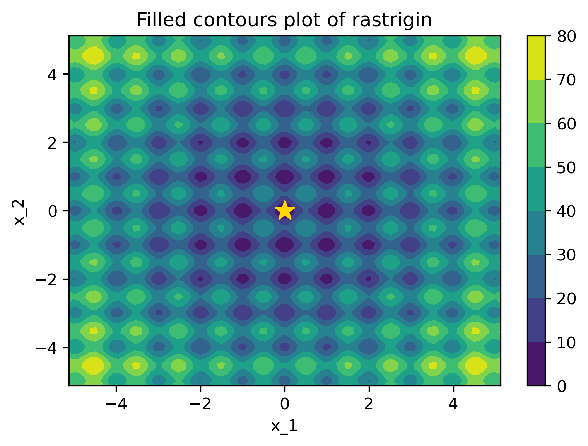
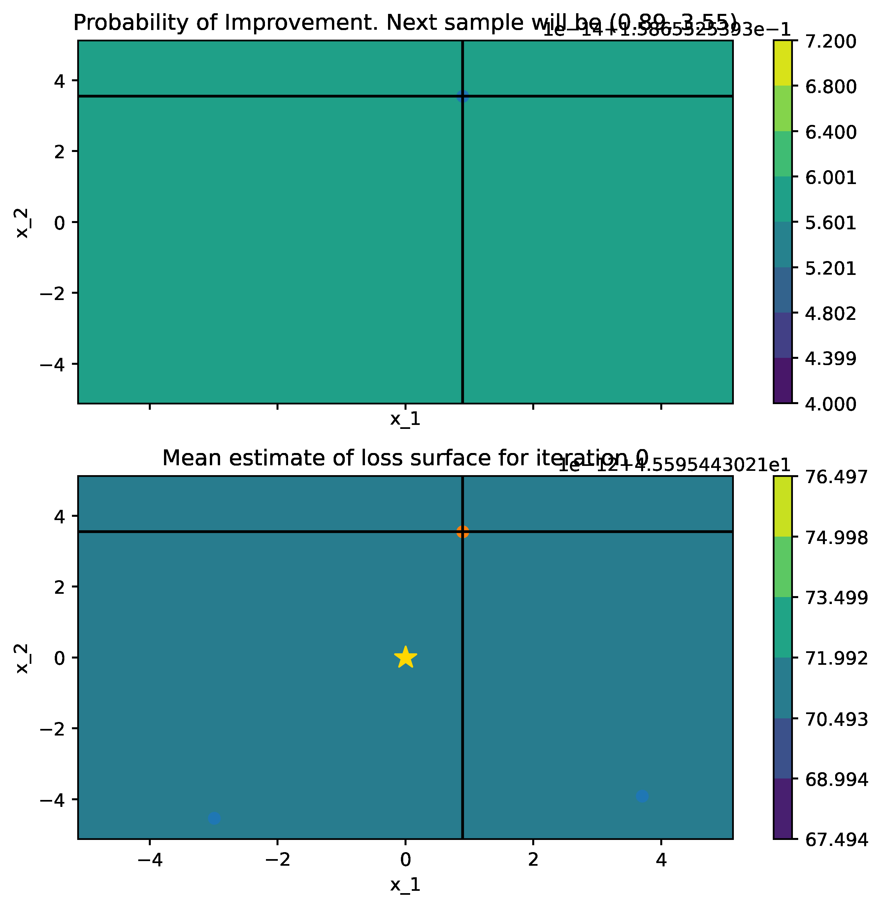

# PI and EI under gaussian noise assumption

This repository contains Python code for Bayesian optimization PI, EI and a modification of PI (MPI) and EI (MEI) under gaussian noise assumption.
 It has three files:

* `bo_acquis.py`: code for Bayesian Optimisation, PI and EI modified from [bayesian-optimization](https://github.com/thuijskens/bayesian-optimization), and new code for MPI and MEI.
* `plotters.py` : plotter functions for plotting surface for estimated loss and acquisition value in each iteration adapted from [bayesian-optimization](https://github.com/thuijskens/bayesian-optimization).
that contains the optimization code, and utility functions to plot iterations of the algorithm, respectively.
* `PI_EI_MPI_MEI_Benchmark.ipynb`: A tutorial that uses the Bayesian algorithm with the 4 acquisitions to find the global optima on noise corrupted [benchmark functions](http://www.resibots.eu/limbo/bo_benchmarks.html).

The signature of the optimization function is still:

```python
bayesian_optimisation(n_iters, sample_loss, bounds, x0=None, n_pre_samples=5,
                      gp_params=None, random_search=False, alpha=1e-5, epsilon=1e-7)
```

### Background

PI and EI are two acquisition functions that return Probability of Improvement and Expected Improvement with respect to current optima $\tilde{y}$.
In some cases, the evaluations on loss function has a noise $y_i \sim \mathcal{N} (f(\mathbf{x})_i,\sigma^2_y)$. 
PI and EI are modified under the assumption that the current optima has a noise. They calcualtes Probability of Improvement and Expected Improvement with respect to 
posterior variance of loss optimum $\kappa(\tilde{\mathbf{x}},\tilde{\mathbf{x}})$ instead.  (where $\tilde{\mathbf{x}}$ is parameter setting at current optima.) 
To lean the gaussian noise in sampling loss functions and update the uncertainty quantification at evaluated locations,
we add a white kernel into the originally adopted GP matern kernel. 

 Let $\rho$ denotes $\sqrt{\kappa (\mathbf{x}, \mathbf{x})+ \kappa (\tilde{\mathbf{x}}, \tilde{\mathbf{x}})-2 \kappa (\mathbf{x}, \tilde{\mathbf{x}})}$. Mathematical expression of Modified PI and EI under gaussian noise assumption:

$$
\text{Modified PI: }  a_{MPI}(x) = \Phi \left(\frac{\mu(\tilde{\mathbf{x}}) - \mu ( \mathbf{x} ) }{\rho})\right)
$$

$$
\text{Modified EI: } a_{MEI} = \Phi(\frac{\mu(\tilde{\mathbf{x}}) - \mu(\mathbf{x})}{\rho})(\mu(\tilde{\mathbf{x}}) - \mu(\mathbf{x}))+
        \phi(\frac{\mu(\tilde{\mathbf{x}}) - \mu(\mathbf{x})}{\rho})\rho
$$

### Current Experiment Result

We test Bayesian Optimisation with 4 acquisition functions on all benchmark functions and using Gaussian Process as surrogate model.
PI and EI under GP model with matern kernel and matern+white kernel are both used as a control group.

Together with white kernel, MPI shows a better result and more stable performance than PI on most of the benchmark functions 
against pre-set gaussian noise $\(\mathcal{\mu=0,\sigma = 10})$, and is believed to be even better when the noise becomes bigger.

Below is the lowest loss we achieved on each benchmark function adding a gaussian noise $\(\mathcal{\mu=0,\sigma = 10})$.
Bayesian Optimisation parameter-setting is : iter = 45, random_search=10000. 
The result is averaged throughout 30 repeated trails, in mean±std.
|acquisition functions   |six-hump       |rastrigin      |goldstein      |rotated-hyper-ellipsoid|sphere          |
|------------------------|---------------|-------------  |-------------- |-----------------------|----------------|
|MPI, kernel=matern+white|-21.58±5.30|-10.20±6.10|10.77±5.85 |-21.54±5.40        |-15.28±6.77|
|MEI, kernel=matern+white|-20.34±4.04|-10.98±4.64|24.20±8.47 |-18.11±4.97        |-15.65±5.29 |
|PI, kernel=matern+white |-14.96±5.34|-3.34±9.15 |28.83±18.46|14.70±76.71        |-12.20±5.68 |
|EI, kernel=matern+white |-16.56±5.82|-4.60±8.27 |23.60±7.19 |-18.84±5.61        |-14.68±5.36 |
|PI, kernel=matern       |-21.75±5.28|-6.39±6.85 |13.16±6.09 |-16.33±4.51        |-15.14±5.83 |
|EI, kernel=matern       |-20.57±4.74|-8.29±7.45 |22.9±47.27 |-18.43±5.15        |-13.52±6.05 |


Perform Bayesian Optimisation on rastrigin function with PI (kernel=matern) and MPI (kernel = matern+white); probability of improvement and loss surface in each iteration is plotted.
Here MPI performs more like PI which focus to exploit at one point, and PI is disturbed by noise and lost its focus.


|                Rastrigin Surface                 |                      PI Searching Trajectory                       |                      MPI Searching Trajectory                       |
|:------------------------------------------------:|:------------------------------------------------------------------:|:-------------------------------------------------------------------:|
|  |  |  |


